# Security Implementation Flowcharts

Visual guide to understanding the security enhancement implementation for Vastel HelpDesk.

---

## 1. Overall Implementation Timeline

---

## 2. Authentication Flow - Before vs After

### Current (Insecure) Flow

### New (Secure) Flow

```mermaid
sequenceDiagram
    participant User
    participant Login Page
    participant API
    participant Database
    participant Dashboard
    participant Middleware
    
    User->>Login Page: Enter email/password
    Login Page->>API: POST /api/auth/login
    
    API->>API: Rate limit check<br/>(5 attempts/15min) ✅
    API->>API: Input validation<br/>(Zod schema) ✅
    API->>Database: SELECT * WHERE email=?
    Database-->>API: User with hashed password
    API->>API: bcrypt.compare()<br/>(secure hash) ✅
    
    alt Password valid
        API->>API: Generate JWT<br/>(expires in 24h) ✅
        API-->>Login Page: Set httpOnly cookie ✅
        Login Page->>Dashboard: Redirect to /dashboard
        Dashboard->>Middleware: Request page
        Middleware->>Middleware: Verify JWT ✅
        Middleware->>Middleware: Check role permissions ✅
        Middleware-->>Dashboard: Allow access
        Dashboard->>API: GET /api/auth/verify
        API-->>Dashboard: Current user data
    else Password invalid
        API->>Database: Log failed attempt ✅
        API-->>Login Page: ❌ Invalid credentials
    end
```

---

## 3. Request Protection Flow

---

## 4. Password Hashing Implementation Flow

---

## 5. JWT Session Management Flow

---

## 6. Input Validation Flow (Zod)

---

## 7. Rate Limiting Flow

---

## 8. Middleware Authorization Decision Tree

---

## 9. Security Audit Logging Flow

---

## 10. Complete Security Stack Visualization

```mermaid
graph TB
    subgraph Client Browser
        User[User] --> LoginUI[Login Page]
        LoginUI --> Dashboard[Dashboard]
    end
    
    subgraph Next.js Middleware Layer
        Middleware[Middleware.ts<br/>✅ JWT Verification<br/>✅ Role Check]
    end
    
    subgraph API Layer
        API1["/api/auth/login<br/>✅ Rate Limit<br/>✅ Input Validation<br/>✅ bcrypt Compare"]
        API2["/api/tickets<br/>✅ Auth Check<br/>✅ Input Validation<br/>✅ Authorization"]
        API3["/api/users<br/>✅ Admin Only<br/>✅ Input Validation<br/>✅ Password Hash"]
    end
    
    subgraph Database Layer
        DB[(Supabase<br/>✅ Hashed Passwords<br/>✅ RLS Policies<br/>✅ Audit Logs)]
    end
    
    subgraph External Services
        Redis[Upstash Redis<br/>Rate Limiting]
        Monitor[Security<br/>Monitoring]
    end
    
    User --> Middleware
    Middleware --> Dashboard
    Middleware --> API1
    Middleware --> API2
    Middleware --> API3
    
    API1 --> Redis
    API1 --> DB
    API2 --> DB
    API3 --> DB
    
    API1 --> Monitor
    API2 --> Monitor
    API3 --> Monitor
    
    style Middleware fill:#4ecdc4
    style API1 fill:#95e1d3
    style API2 fill:#95e1d3
    style API3 fill:#95e1d3
    style DB fill:#ffd93d
    style Redis fill:#ff6b6b
    style Monitor fill:#c8e6c9
```

---

## Key Takeaways

### Color Legend
- 🔴 **Red/Pink**: Errors, blocks, failures, unauthorized
- 🟠 **Orange**: Warnings, redirects, less critical issues
- 🟢 **Green**: Success, allowed, secure operations
- 🔵 **Blue**: Information, neutral states
- 🟡 **Yellow**: Data storage, important resources

### Implementation Priority
1. **Phase 1 (Red)**: Critical security fixes - foundation of all other improvements
2. **Phase 2 (Orange)**: High-priority hardening - prevents common attacks
3. **Phase 3 (Teal)**: Production hardening - defense in depth

### Flow Summary
- **Before**: Simple but insecure (plain passwords, localStorage, no protection)
- **After**: Multi-layered security (hashing, JWT, middleware, validation, logging)

For detailed implementation code and steps, refer to [`implementation_plan.md`](file:///C:/Users/hp/.gemini/antigravity/brain/e852d4c2-1acc-4c7e-943f-56e13200ab44/implementation_plan.md).
