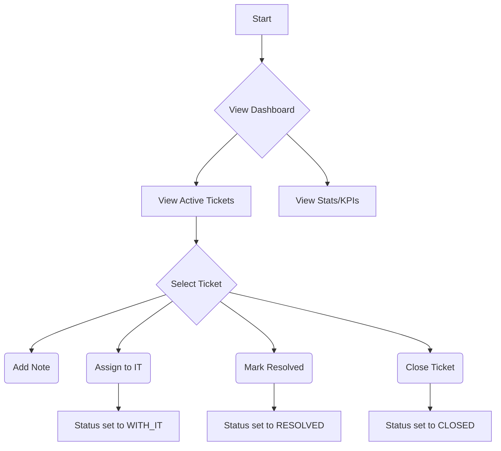
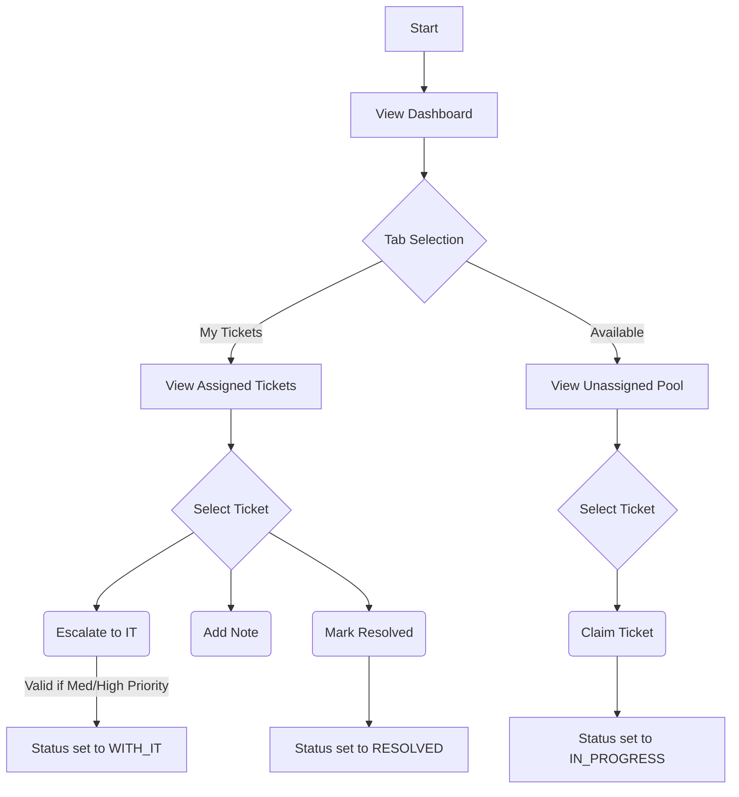
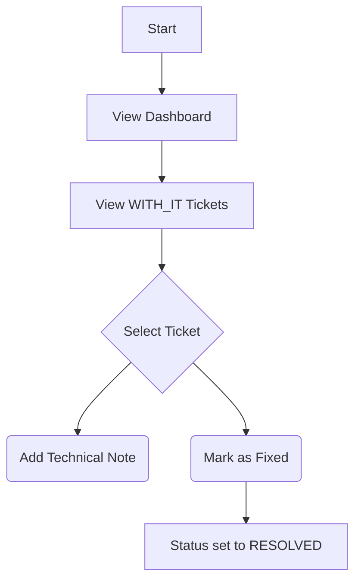
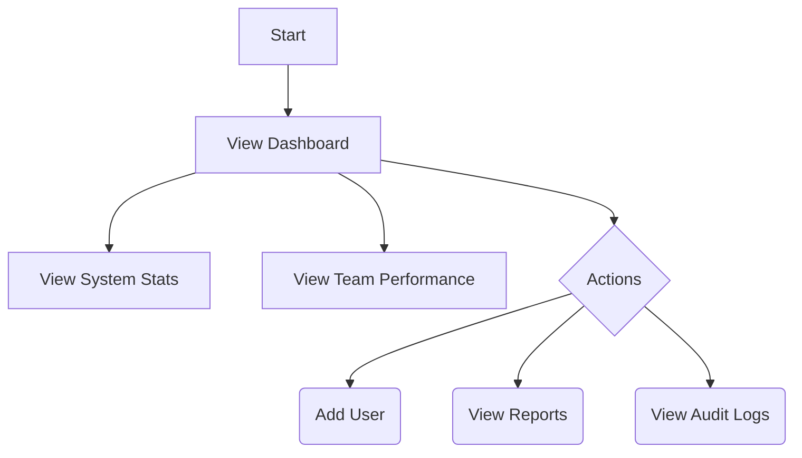

# Project Documentation: Vastel Helpdesk Application

## 1. Executive Summary

The **Vastel Helpdesk Application** is a modern, role-based ticketing system designed to streamline customer support operations. It features a hierarchical workflow where tickets move through specific stages handled by different agent roles (Senior, Junior, IT). The application is built as a monolithic Next.js application, utilizing the App Router for frontend views and API Routes for backend logic.

## 2. Technology Stack

### Frontend

- **Framework**: Next.js 16.1.1 (App Router)
- **Library**: React 19.2.3
- **Styling**: Tailwind CSS 4
- **State/Modals**: `react-rnd` (for draggable windows), standard React hooks.
- **Visualization**: `recharts` for dashboard analytics.
- **Form Handling**: Native React controlled components.

### Backend

- **Runtime**: Node.js (via Next.js Edge/Node Runtimes).
- **API Framework**: Next.js API Routes (`src/app/api/**`).
- **Database ORM**: Prisma (`@prisma/client` ^5.22.0).

### Database

- **System**: MySQL.
- **Schema**: Relational model centered around `User` and `Ticket` entities.

## 3. Architecture Overview

### 3.1 Frontend Architecture

The frontend uses a **Role-Based Routing** strategy implemented via Next.js Route Groups.

- **Route Structure**:
  - `src/app/(agents)/`: Contains the protected dashboard layouts.
    - `senior/`: Views specific to Senior CS agents.
    - `junior/`: Views specific to Junior CS agents.
    - `it/`: Views specific to IT Support.
  - `src/app/admin/`: Dedicated Admin dashboard.
  - `src/app/login/`: Public entry point.

- **Authentication & Gating**:
  - **Mechanism**: Client-side protection in `src/app/(agents)/layout.tsx`.
  - **Behavior**: Checks `localStorage` for user data. Redirects mismatches (e.g., a Junior trying to access `/senior` is forced back to `/junior`).
  - **Security Note**: This is a prototype-level implementation. Production would require server-side session cookies (JWT/NextAuth) to prevent bypassing client checks.

### 3.2 Backend Architecture

The backend is exposed as valid REST endpoints within the same Next.js application.

- **Endpoints**: Located in `src/app/api/`.
  - `auth/login`: Validates credentials against the database.
  - `tickets`: CRUD operations for tickets.
  - `users`: User management (Admin only).
  - `stats/performance`: Aggregates data for dashboards.

- **Data Access**:
  - All database interaction goes through the singleton `PrismaClient` instance (`src/lib/db.ts`) to manage connection pooling.

## 4. Role Hierarchy & Workflows

The system defines four distinct roles with specific permissions (`src/types` & `schema.prisma`):

### 👮 Administrator

- **Scope**: System-wide.
- **Capabilities**: User management, global analytics/reports, system configuration.

### 👨‍💼 Senior CS Agent (Supervisor)

- **Scope**: Ticket management and team oversight.
- **Workflow**:
  1.  **Create**: Logs new tickets from customers.
  2.  **Triage**: Analyzes incoming tickets.
  3.  **Assign**: Delegates to Junior CS or IT Support.
  4.  **Review**: Validates work marked as "Done" by Juniors.
  5.  **Close**: Finalizes the ticket lifecycle.
- **KPIs**: Review turnaround time, accurate assignment rate.

### 👩‍💻 Junior CS Agent (Executor)

- **Scope**: Handling standard tickets.
- **Workflow**:
  1.  **Work**: Addresses assigned tickets (Status: `IN_PROGRESS`).
  2.  **Resolve**: Marks tickets as `PENDING_REVIEW` when finished.
  3.  **Self-Assign**: Can claim unassigned tickets from the pool.
- **KPIs**: Resolution speed, quality score (low rejection rate).

### 🔧 IT Support (Technical)

- **Scope**: Specialized technical escalations.
- **Workflow**:
  1.  **Receive**: Gets tickets with `WITH_IT` status.
  2.  **Fix**: Resolves technical bugs/issues.
  3.  **Return**: Marks as `RESOLVED` (bypassing some review steps dependent on workflow).

## 5. Data Model (Key Entities)

### `User`

- **Fields**: `name`, `email`, `role`, `avatar`.
- **Purpose**: Identity and permission scoping.

### `Ticket`

- **Fields**: `status`, `priority`, `assignedTo`, `createdBy`.
- **Status Enum**: `OPEN`, `TRIAGE`, `IN_PROGRESS`, `RESOLVED`, `CLOSED`, `PENDING_REVIEW`, `WITH_IT`.
- **Lifecycle**: Tracks the journey from creation to closure.

### `Activity` & `Note`

- **Purpose**: Audit logging and internal communication on specific tickets.

## 6. Current Implementation Status

- **Core Flows**: Authentication and basic Ticket CRUD are functional.
- **UI/UX**: Responsive dashboards using Tailwind. Components are modular (e.g., `CustomSelect`, `ChatWidget`).
- **Pending Features**:
  - Advanced KPI capabilities (Phase 2).
  - More robust server-side authentication.
  - Real-time websocket implementation (currently uses polling for chat).

## 7. Detailed Feature Specifications

### 7.1 User Management

**API Endpoint**: `/api/users`

- **GET**: Lists all users.
  - _Response_: JSON array of users (passwords excluded). Dates formatted as ISO strings.
- **POST**: Creates a new user.
  - _Validation_: Requires `name`, `email`, `password`.
  - _Constraint_: Checks for unique email.
  - _Security_: Currently stores passwords in plain text (Demo Mode).

**Frontend Implementation**:

- **Admin Layout**: Admin users have exclusive access to user management UI.
- **Role Assignment**: Roles (`senior`, `junior`, `it`) are assigned at creation and determine dashboard access.

### 7.2 Ticket Lifecycle System

**API Endpoint**: `/api/tickets`

- **GET Options**:
  - Filtering by `status`, `priority`, `assigned_to`.
  - Pagination via `limit` and `offset`.
  - `unassigned=true` filter for queue management.
- **POST (Creation)**:
  - _Validation_: Mandatory `subject` and `customer_name`.
  - _Automation_: Auto-generates sequential Ticket ID (e.g., #10001) by finding the max existing ID.
  - _Side Effect_: Logs `TICKET_CREATED` activity.

**Key Logic**:

- **Status Flow**: `OPEN` -> `TRIAGE` -> `IN_PROGRESS` -> `RESOLVED` / `CLOSED`.
- **Assignment**: Tickets link to a `User`.
- **Activity Logging**: Critical actions (creation, status change) are recorded in the `Activity` table for audit trails.

### 7.3 Real-time Chat Widget

**Component**: `ChatWidget.tsx`

- **Architecture**: Client-side polling (Interval: 3000ms).
- **UI**: Draggable window using `react-rnd`.
- **Features**:
  - **Role Filtering**: Filter contacts by "Senior", "Junior", "IT", "Admin".
  - **Unread Global Count**: Sums unread messages across all contacts.
  - **Sound**: Plays `/sounds/notification.mp3` on mount/update.
- **Data Flow**:
  1. Fetch Contacts (`/api/chat/users`).
  2. Select Contact -> Fetch/Create Conversation (`/api/chat/conversations`).
  3. Send Message (`/api/chat/messages`).

### 7.4 Analytics & KPI System

**API Endpoint**: `/api/stats`

- **Trend Analysis**:
  - `period=today/week`: Calculates hourly/daily ticket volume and handling time.
  - `period=month/year`: Aggregates by month.
  - _Logic_: Uses `closedAt` timestamp to determine inclusion in trend.
- **Scoring Engine (User Stats)**:
  - **Base Score (60%)**: Based on volume of keys closed vs target (35).
  - **Speed Bonus (25%)**:
    - < 24h avg handling time = Full bonus.
    - < 48h avg handling time = Partial bonus.
  - **Quality Bonus (15%)**: Fixed flat bonus in current implementation.
  - **Role Exclusions**: IT Support role is excluded from this scoring logic.

### 7.5 Database Enums & Types

- **Roles**: `senior`, `junior`, `it`, `admin`.
- **Ticket Statuses**: `OPEN`, `TRIAGE`, `IN_PROGRESS`, `RESOLVED`, `CLOSED`, `PENDING_REVIEW`, `WITH_IT`.
- **Priorities**: `HIGH`, `MEDIUM`, `LOW`.

## 8. Role Workflows (Flowcharts)

### 8.1 Senior Agent Workflow

### 8.2 Junior Agent Workflow

### 8.3 IT Support Workflow

### 8.4 Admin Workflow

/// Profile Picture Upload
Cara Kerja:
User pilih file di modal
File langsung di-upload ke /api/upload
Server convert ke Base64 → return sebagai data URL
State terupdate dengan data URL
Saat submit form, Base64 avatar disimpan ke database
Avatar tampil di UI sebagai image langsung tanpa external link

Fitur:
✅ Preview image sebelum submit
✅ Validasi file type & size
✅ Loading state saat upload
✅ Remove avatar button
✅ Toast feedback
✅ Responsif & user-friendly
