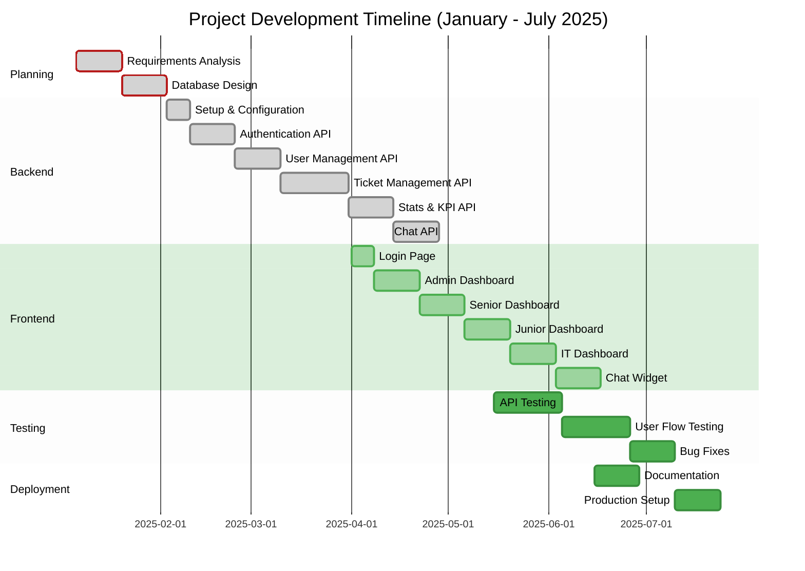

# Project Timeline: Vastel Helpdesk Application

---

##  

---

## Timeline Summary

| Phase | Duration | Period |
|-------|----------|--------|
| Planning | 1 month | January 2025 |
| Backend Development | 3 months | February - April 2025 |
| Frontend Development | 3 months | April - June 2025 |
| Testing & QA | 2 months | May - June 2025 |
| Deployment | 2 weeks | July 2025 |

**Total Duration: 7 months (January - July 2025)**
