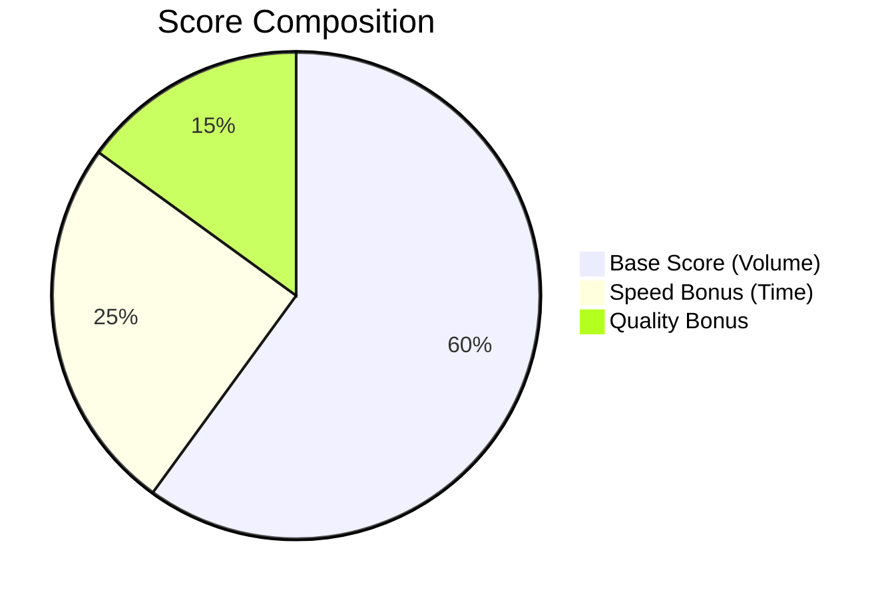
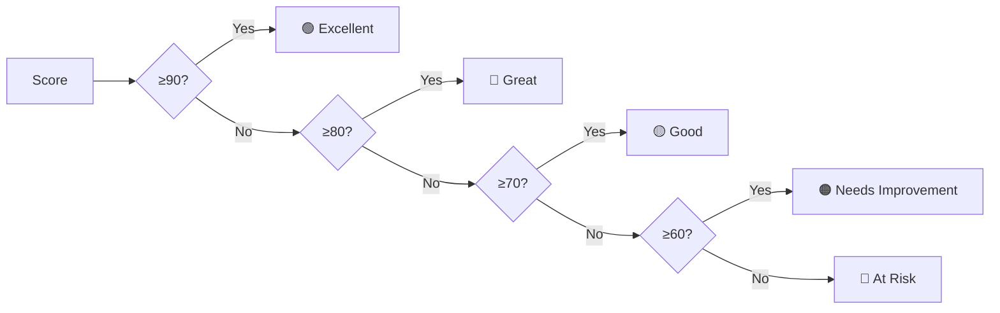

# Performance Scoring System

## Overview

This document describes how agent performance scores are calculated in the Vastel CS Dashboard.

## Applicable Roles

| Role | Scored? | Monthly Target |
|------|---------|----------------|
| Junior CS | ✅ Yes | 30 tickets |
| Senior CS | ✅ Yes | 40 tickets |
| IT Support | ❌ No | N/A |
| Admin | ❌ No | N/A |

---

## Score Calculation Formula

```
TOTAL SCORE = Base Score + Speed Bonus + Quality Bonus
            = (max 60)   + (max 25)     + (max 15)
            = 100 points maximum
```

---

## Score Breakdown



### 1. Base Score (60% weight)

Measures ticket completion rate against monthly target.

```
Base Score = (Completed Tickets / Target) × 60

Examples:
- Junior completes 30/30 → 60 pts
- Junior completes 15/30 → 30 pts
- Senior completes 40/40 → 60 pts
- Senior completes 20/40 → 30 pts
```

### 2. Speed Bonus (25% weight)

Measures average ticket resolution time.

| Avg Handling Time | Bonus Points |
|-------------------|--------------|
| ≤ 24 hours | 25 pts |
| ≤ 48 hours | 15 pts |
| > 48 hours | 5 pts |

### 3. Quality Bonus (15% weight)

Currently fixed at **15 points** (no rejection tracking implemented yet).

Future implementation could include:
- Ticket re-open rate
- Customer satisfaction scores
- Senior review feedback

---

## Rating Thresholds



| Score Range | Rating | Badge Color |
|-------------|--------|-------------|
| 90 - 100 | Excellent | Green |
| 80 - 89 | Great | Blue |
| 70 - 79 | Good | Yellow |
| 60 - 69 | Needs Improvement | Orange |
| 0 - 59 | At Risk | Red |

---

## Example Calculations

### Example 1: High Performer
```
Agent: Junior CS
Completed: 28 tickets (target: 30)
Avg Time: 18 hours

Base Score  = (28/30) × 60 = 56 pts
Speed Bonus = 25 pts (≤24h)
Quality     = 15 pts
────────────────────────────
TOTAL       = 96 pts → "Excellent"
```

### Example 2: Average Performer
```
Agent: Junior CS
Completed: 20 tickets (target: 30)
Avg Time: 36 hours

Base Score  = (20/30) × 60 = 40 pts
Speed Bonus = 15 pts (≤48h)
Quality     = 15 pts
────────────────────────────
TOTAL       = 70 pts → "Good"
```

### Example 3: At Risk
```
Agent: Junior CS
Completed: 10 tickets (target: 30)
Avg Time: 72 hours

Base Score  = (10/30) × 60 = 20 pts
Speed Bonus = 5 pts (>48h)
Quality     = 15 pts
────────────────────────────
TOTAL       = 40 pts → "At Risk"
```

---

## Visual Flow

```
┌─────────────────────────────────────────────────────────────────┐
│                     PERFORMANCE SCORE SYSTEM                     │
├─────────────────────────────────────────────────────────────────┤
│                                                                  │
│  ┌──────────────┐     ┌──────────────┐     ┌──────────────┐     │
│  │   TICKETS    │     │  RESOLUTION  │     │   QUALITY    │     │
│  │  COMPLETED   │     │     TIME     │     │   (FIXED)    │     │
│  └──────┬───────┘     └──────┬───────┘     └──────┬───────┘     │
│         │                    │                    │              │
│         ▼                    ▼                    ▼              │
│  ┌──────────────┐     ┌──────────────┐     ┌──────────────┐     │
│  │  BASE SCORE  │     │ SPEED BONUS  │     │QUALITY BONUS │     │
│  │   (0-60)     │     │   (5-25)     │     │    (15)      │     │
│  └──────┬───────┘     └──────┬───────┘     └──────┬───────┘     │
│         │                    │                    │              │
│         └────────────────────┼────────────────────┘              │
│                              ▼                                   │
│                     ┌──────────────┐                            │
│                     │ TOTAL SCORE  │                            │
│                     │   (0-100)    │                            │
│                     └──────┬───────┘                            │
│                            │                                     │
│                            ▼                                     │
│  ┌──────────────────────────────────────────────────────────┐   │
│  │                      RATING                               │   │
│  │  90-100: Excellent │ 80-89: Great │ 70-79: Good          │   │
│  │  60-69: Needs Improvement │ 0-59: At Risk                │   │
│  └──────────────────────────────────────────────────────────┘   │
│                                                                  │
└─────────────────────────────────────────────────────────────────┘
```

---

## Implementation Location

The scoring logic is implemented in:
- **File**: `src/app/api/performance/route.ts`
- **Lines**: 100-137

---

## Future Improvements

1. **Dynamic Quality Score**: Track ticket re-opens and rejection rates
2. **Priority Weighting**: Give more points for HIGH priority tickets
3. **SLA Compliance**: Track if tickets meet priority-based time targets
4. **Customer Feedback**: Integrate satisfaction ratings
